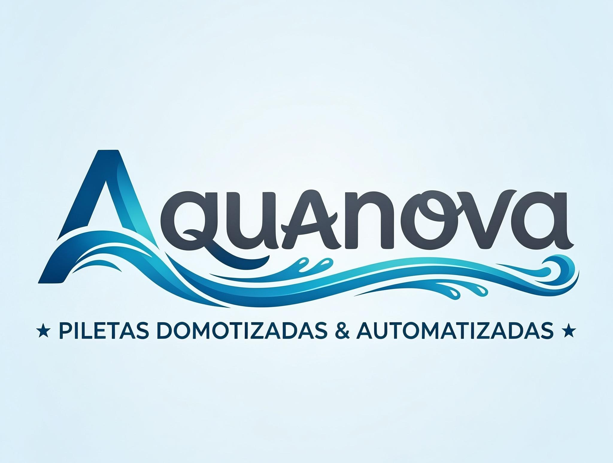

  

# 🌊 Aquanova - Piletas Inteligentes del Futuro

Bienvenido a **Aquanova**, la plataforma líder en construcción, domotización y automatización de piletas. Transformamos tu espacio en un oasis tecnológico con sistemas de última generación.

## Visita Nuestra Página

Explora todos nuestros servicios y catálogo de productos en:
 **[https://aquanova-three.vercel.app](https://aquanova-three.vercel.app)**

##  Nuestros Servicios

###  Construcción de Piletas
Diseñamos y construimos piletas personalizadas adaptadas a tu espacio y necesidades. Desde piletas clásicas rectangulares hasta diseños de lujo infinity, tenemos la solución perfecta para ti.

###  Automatización y Domotización
Control total desde tu smartphone. Gestiona:
-  Temperatura del agua
-  Iluminación inteligente
-  Filtrado automático
-  Monitoreo en tiempo real

###  Kit de Domotización
Nuestro kit integral incluye todo lo necesario para convertir tu pileta actual en un sistema inteligente y automatizado.

##  Nuestros Productos

- **Pileta Clásica Rectangular** - Elegancia y funcionalidad
- **Pileta Infinity** - Lujo sin límites
- **Pileta Sport** - Perfecta para deportistas
- **Spa Pool** - Relajación total
- **Pileta Freeform Luxury** - Diseño personalizado
- **Compact Pool** - Ideal para espacios reducidos

##  Desarrollo Local

### Requisitos
- Node.js 18+
- pnpm o npm

### Instalación

```bash
# Instalar dependencias
npm install
```

### Ejecutar en Desarrollo

```bash
# Iniciar servidor de desarrollo
npm run dev
```

La aplicación estará disponible en `http://localhost:5173`

### Build para Producción

```bash
# Compilar para producción
npm run build
```

## 🛠️ Stack Tecnológico

- **Frontend**: React + TypeScript
- **Build Tool**: Vite
- **Styling**: Tailwind CSS + Shadcn/ui
- **Routing**: React Router
- **Animations**: Motion
- **Icons**: Lucide React

## Contacto

¿Preguntas o consultas? Contáctanos a través de nuestra página web en la sección de contacto.

---

**© 2026 Aquanova - Piletas Inteligentes del Futuro** 🌊
  